# Работа с Git и GitHub

[К документации](/docs/README.md)

В данном файле представлены инструкции по работе с локальными репозиториями `git`, а также глобальны репозиторием на `GitHub`. Информация изложена пошагово. Если ты только начинаешь вливаться в проект, нужно изучить их `с самого начала`, если локальный репозиторий уже установлен, можно начинать с шага `№3`.

## 0. Теория

<b>Git</b> - система контроля версий, которая позволяет разрабатывать один продукт нескольким разработчикам, не мешая друг другу. Это достигается при использовании `веток (branch)` - копий главной версии проекта, над которой имеют власть только один или несколько разработчиков, объединённых в более маленькие команды. Все ветки объединены в одном `репозитории`, который содержит весь код проекта. Главная версия проекта обычно лежит в ветке `master` или `main` (в нашем случае - `master`). К master ветке имеет полный доступ только один человек - создатель репозитория (в нашем случае - [Vladislav Zheltov](https://github.com/vladzheltov1)), все остальные могут просматривать код, копировать его себе, но не могут изменять код ветки. Чтобы снести изменения в главную ветку, нужно создать `вилку (fork)` проекта. Fork - копирование репозитория на собственный аккаунт. Такой репозиторий будет принадлежать тебе целиком, ты можешь менять любой код в любой ветке. Как только изменения сделаны, и функционал, над которым ты работал, готов, можно создать `pull request` - запрос на внесение изменений в главную ветку проекта (как это сделать будет показано чуть позже). Запрос на изменение можно делать не только в главную ветку, но и другие ветки, которые есть в проекте. Как только автор репозитория сделает `code review` - обзор кода, при котором автор изменений получает комментарии по улучшению кода - изменения будут внесены в ветку проекта.

Таким образом можно вести разработку разных частей проекта, при этом каждый из участников будет занят своим делом.

Более подробную информацию ищи ниже, если что-то останется непонятным, смотри ролики, предложенные в самом низу.


## 1. Установка Git на компьютер и регистрация на GitHub

Первый шаг, который необходимо проделать - регистрация на сайте [GitHub](https://github.com) - облачное хранилище репозиториев проекта. Стоит помнить, что `имя пользователя (user name)` - будет <b>`ПУБЛИЧНЫМ`</b>!

После регистрации и подтверждения аккаунта по почте, нужно скачать систему контроля версий [Git](https://git-scm.com/downloads) на своё устройство, с которого будет вестись разработка. <b>`ВАЖНО:`</b> необходимо следовать всем шагам, предложенным ниже:

`Путь до файла НЕ менять`

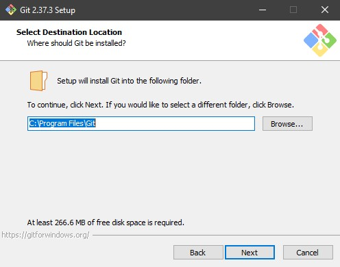

`Оставляем только эти галочки`

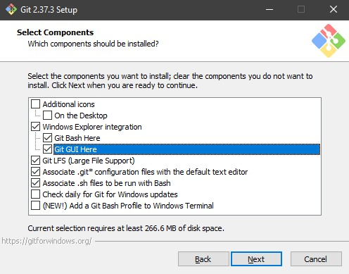

`Ставим галочку снизу`

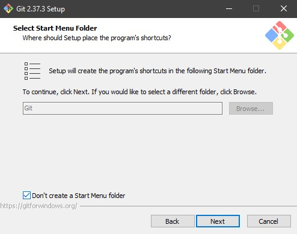

`Выбираем свой любимый редактор, где будете писать код`

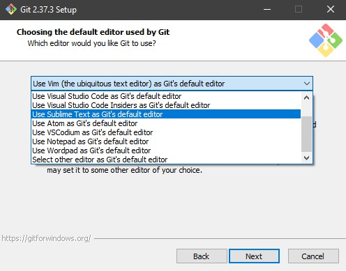

`Если редактора нет в списке, выбираем последний пункт`

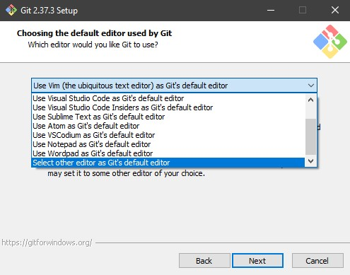

`Нажимаем Browse`

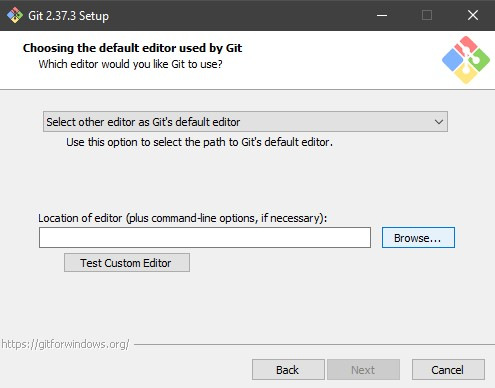

`И ищем .exe файл редактора в проводнике`

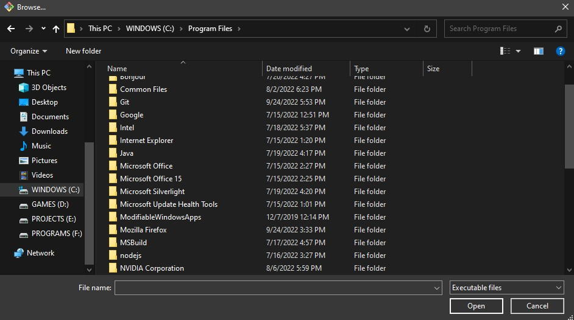

`Далее ставим второй пункт и меняем main -> master`

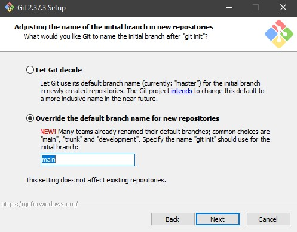

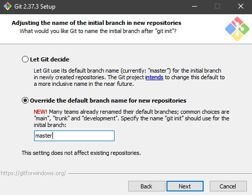

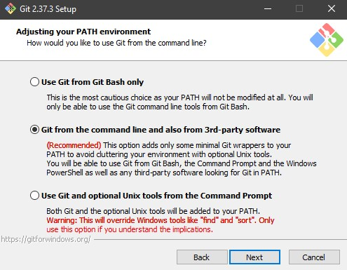

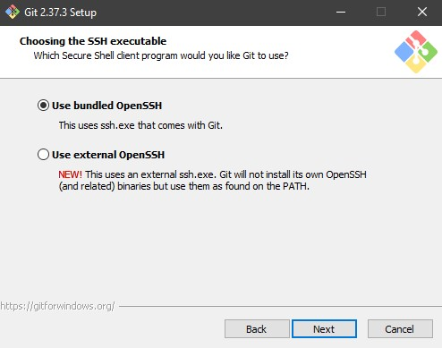

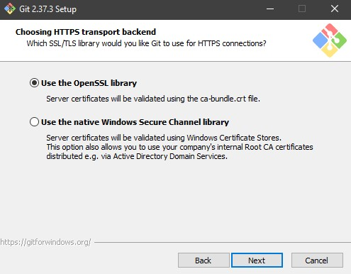

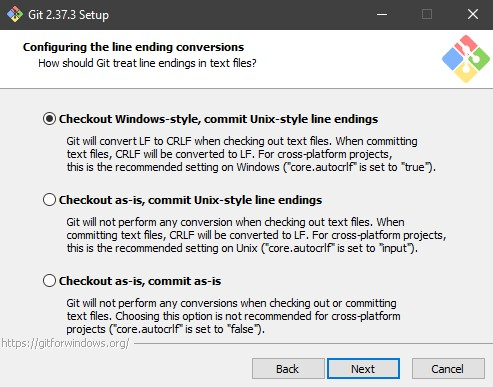

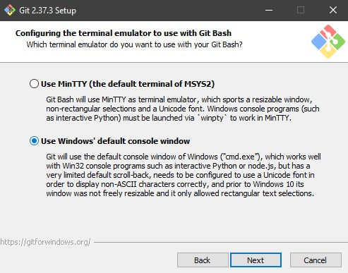

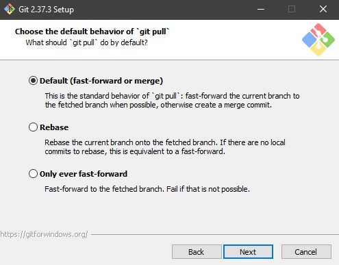

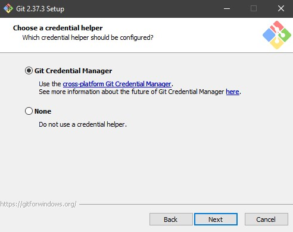

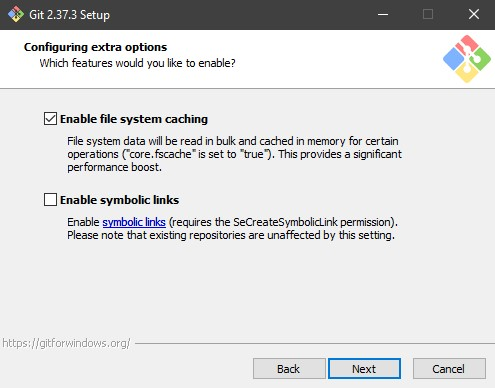

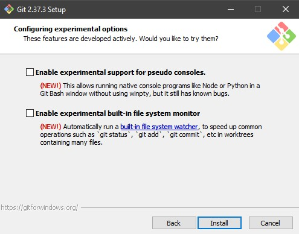

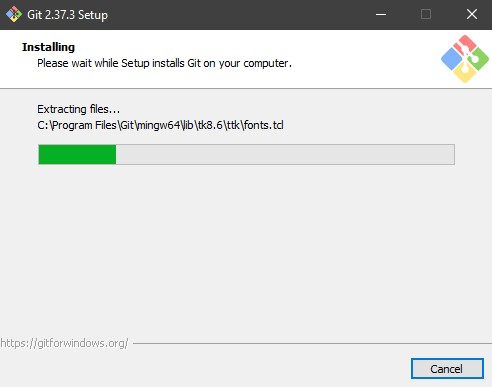

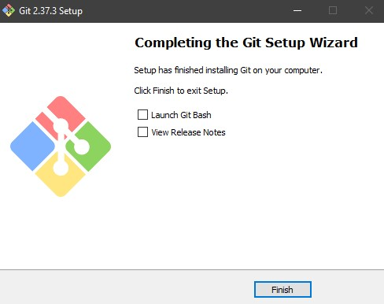

После установки необходимо перезагрузить компьютер.

После перезагрузки открываем `cmd`, там прописываем следующие команды:

```bash
git config --global user.name "{Имя и фамилия на английском}"
git config --global user.email "{Почта с аккаунта GitHub}"
```

После этого устройство готово к работе с проектом.

## 2. Загрузка локальной версии

На данный момент мы можем начинать работать с проектом. Глобальный репозиторий уже создан и настроен, он располагается [здесь](https://github.com/vladzheltov1/bot-compilation).

Заходим на эту страницу и в верхнем правом углу нажимаем кнопку `fork`

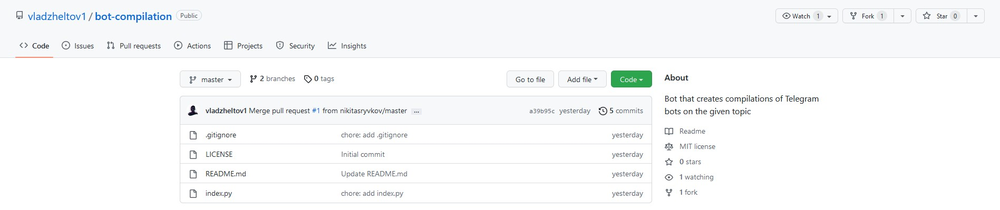

Далее, не меняя никаких данных, нажимаем на зелёную кнопку.

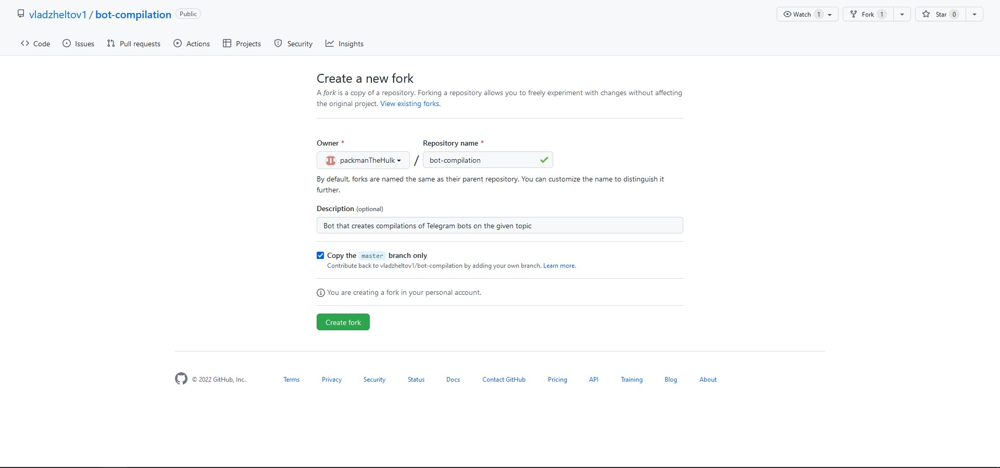

После чего копируем адрес открывшейся страницы

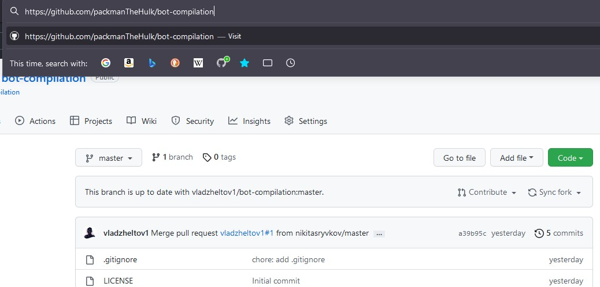

Открываем проводник, там в любом месте создаем папку `projects`, заходим в неё и открываем эту папку в `cmd`:

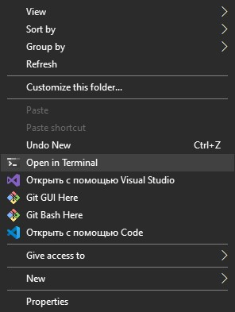

После чего прописываем следующие команды:

```bash
git clone https://github.com/{твой_логин}/bot-compilation # адрес страницы
cd ./bot_compilation
ls
```

После этого в терминале появились все документы проекта. На этом этапе у нас уже есть локальный репозиторий в папке `projects`, теперь его можно открыть в твоём редакторе кода.

## 3. Открываем pull request в главный репозиторий

Отредактируем какой-нибудь файл, например `index.py`:

`+ print("some changed data")`

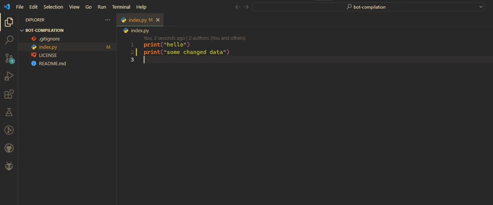

Если это все изменения, которые ты хотел бы сделать, вернись в терминал, там напиши следующие команды:

```bash
git status
```

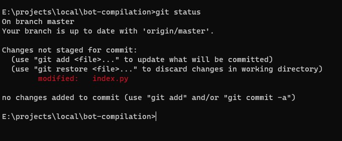

```bash
git add .
```

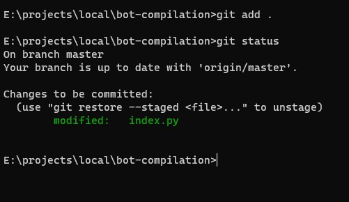

```bash
git commit -m "{осмысленное название пачки изменений на английском}"
```

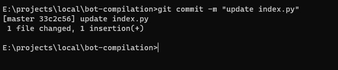

```bash
git push origin master
```

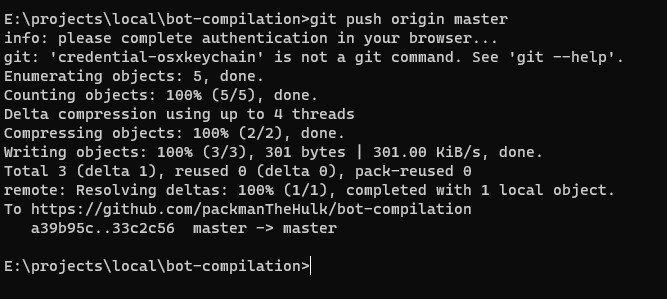

Во время последней команды может появиться такое окно:

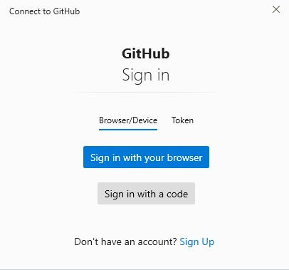

Нажимаем `Sign in with your Browser`

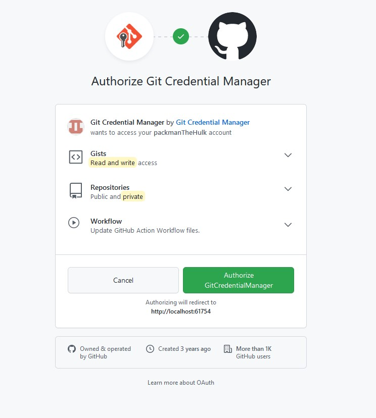

Потом - `Authorize Git Credential manager` (зелёная кнопка)

После этого изменения будут внесены в твой репозиторий:

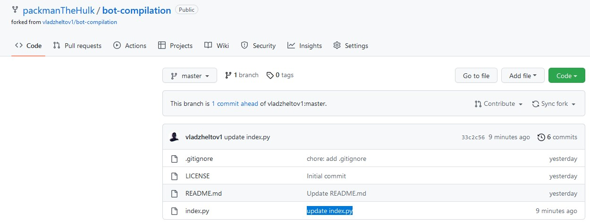

При разработки какого-то функционала можно работать локально и повторять эти же команды каждый раз, когда вносятся какие-то изменения в файлы. Если какой-то функционал закончен, и ты готов залить его в главную ветку, нажми `Contribute`, затем `Open pull request`

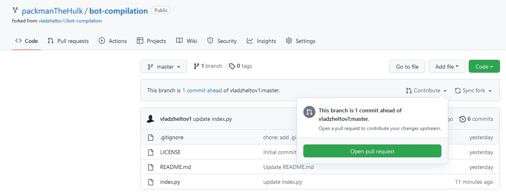

Проверь, что в этом месте из списка выбрана ветка `development`

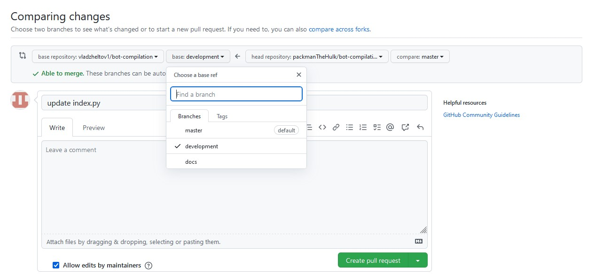

Придумай точное название пачке изменений, которые ты хотел бы опубликовать и нажми `Create pull request`

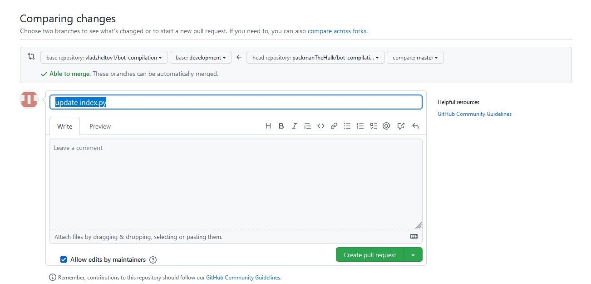

После чего ты окажешься на такой странице:

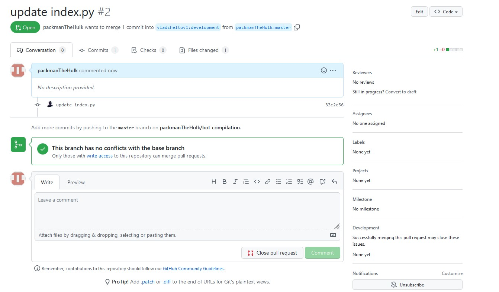

Здесь ты сможешь видеть комментарии, которые тебе оставляют другие разработчики:

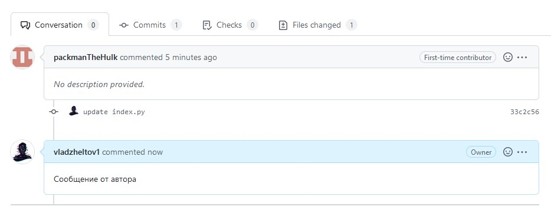

Внимательно читай советы создателя репозитория и следуй его инструкциям. Как только все изменения будут проверены, и также код будет соответствовать всем правилам, твой запрос будет выполнен, и код окажется в ветке главного репозитория, при это `pull request` будет закрыт.

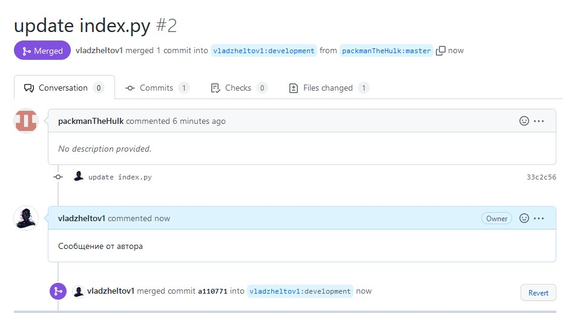

Такой способ работы обеспечит максимально эффективную разработку.

[К документации](/docs/README.md)